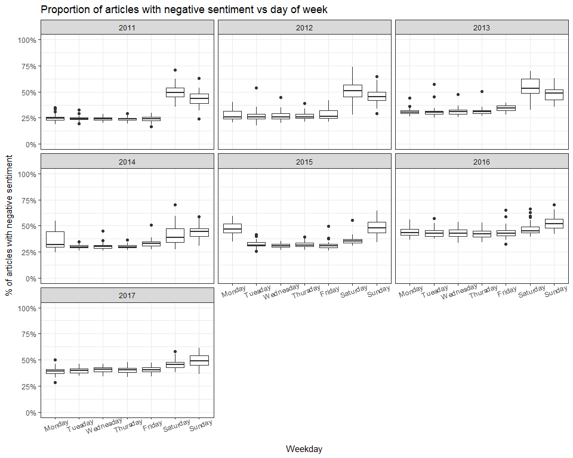
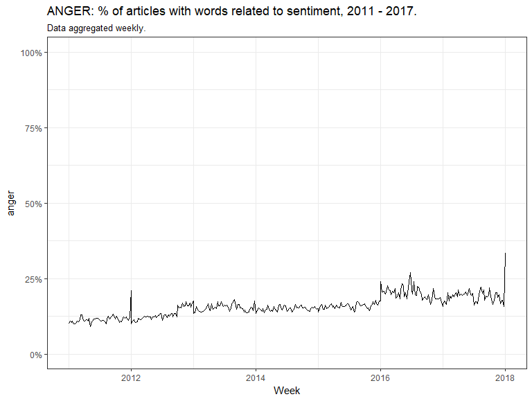
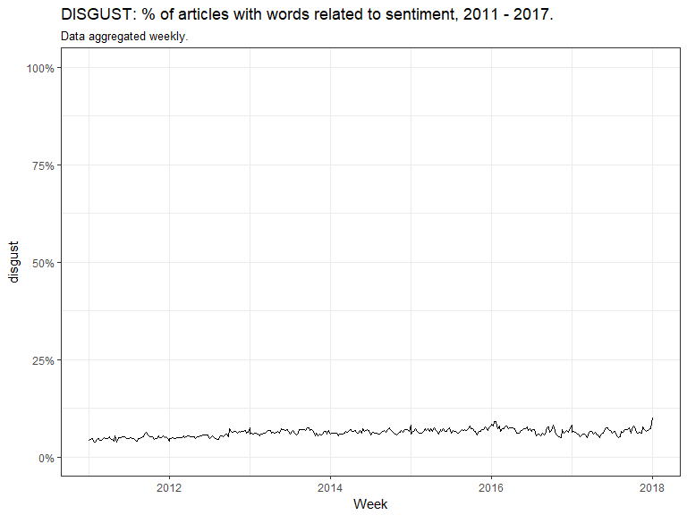
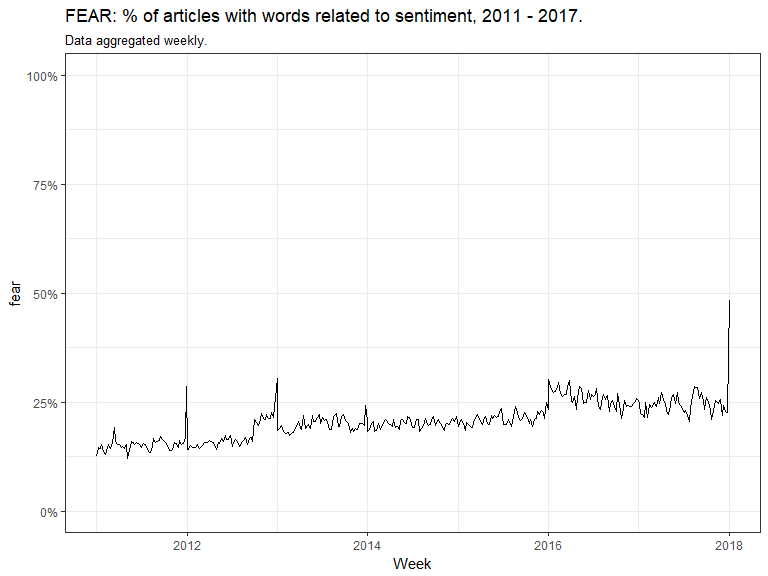
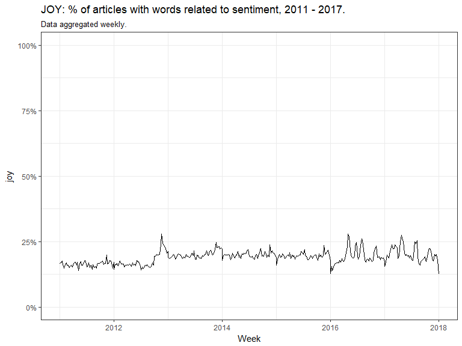
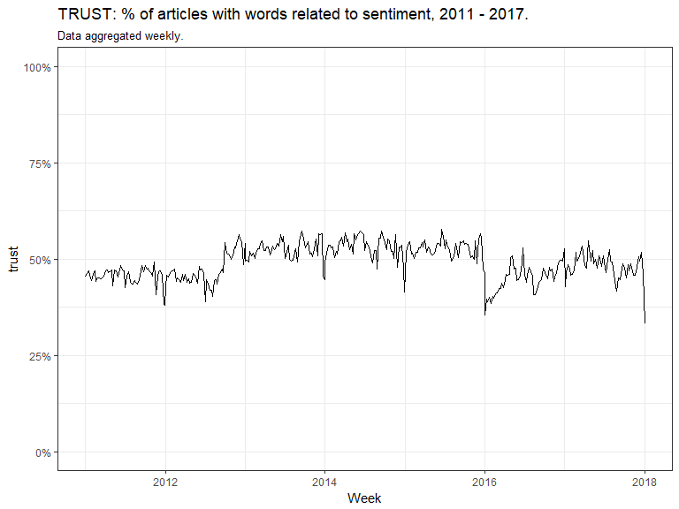

Sentiment analysis on news headlines, 2011-2017
================

<h3>
What's this about?
</h3>
In this short article, we'll play around with an interesting dataset avaible on Kaggle. It's a set of CSV files containing news headlines, as published by Reuters between 2011 and 2017. Dataset is available here: <https://www.kaggle.com/nltkdata/reuters>

This will be a simple example of NLP. We'll do a sentiment analysis on headlines, which will tell us something about what kind of emotions are dominant in headlines published by Reuters. We'll look at trends and seasonality in sentiments.

<br>
<h3>
Data preprocessing
</h3>
First, we load necessary libraries and one useful dataset, stop\_words. We'll use it to exclude English stop words from analysed headlines, as they are of little interest for us.

``` r
library(reshape2)
library(scales)
library(tidytext)
library(dplyr)
library(lubridate)
library(ggplot2)


data(stop_words)

flist <- c("reuters-newswire-2011.csv", "reuters-newswire-2012.csv",
           "reuters-newswire-2013.csv", "reuters-newswire-2014.csv",
           "reuters-newswire-2015.csv", "reuters-newswire-2016.csv",
           "reuters-newswire-2017.csv")
```

The following function will process the CSV file:

``` r
processReutersFile <- function(fname) {
  a <- read.csv(fname,
                header = TRUE,
                stringsAsFactors = FALSE)
  a <- a %>%
    mutate(pdt = as.Date(as.character(publish_time / 10000), "%Y%m%d"))
  
  #mutating data to tidytext format, i.e. one token per row
  words <- a %>% 
    unnest_tokens(word, headline_text) 
  
  #excluding stop words
  words <- anti_join(words, stop_words, by = 'word')
  
  #joining with sentiments data 
  #(which is a dataset consisting of pairs [word, sentiment])
  #after doing that, we'll have a dataset of headline words + sentiments
  words <- left_join(words, get_sentiments("nrc"), by = "word")
  
  #finally, we aggregate:
  #grain: word X date X sentiment
  #function: count
  a11 <- a %>%
    group_by(pdt) %>%
    summarise(articles = n()) %>%
    left_join(
      group_by(words, pdt, sentiment) %>%
        summarise(words_count = n())
    ) %>%
    dcast(pdt + articles ~ sentiment, value.var = "words_count")
  return(a11)
}
```

We process all of the input files & merge them into one:

``` r
f1 <- processReutersFile(flist[1])
f2 <- processReutersFile(flist[2])
f3 <- processReutersFile(flist[3])
f4 <- processReutersFile(flist[4])
f5 <- processReutersFile(flist[5])
f6 <- processReutersFile(flist[6])
f7 <- processReutersFile(flist[7])

dreut <- rbind(f1, f2, f3, f4, f5, f6, f7)
```

And that's how the final datafile looks like:

``` r
head(dreut)
```

    ##   X        pdt articles anger anticipation disgust fear joy negative
    ## 1 1 2011-01-01      136    35           51       9   50  30       74
    ## 2 2 2011-01-02      191    42           53      11   56  24       83
    ## 3 3 2011-01-03     1753   175          550      91  250 327      492
    ## 4 4 2011-01-04     4180   387         1198     169  516 666      825
    ## 5 5 2011-01-05     4332   406         1270     193  496 721      912
    ## 6 6 2011-01-06     4165   432         1301     160  509 744      872
    ##   positive sadness surprise trust   NA.
    ## 1       81      32       29    53   664
    ## 2       87      35       18    60   964
    ## 3     1257     212      183   862 11505
    ## 4     2739     402      392  1890 27998
    ## 5     2947     465      484  1982 29852
    ## 6     2923     421      405  1928 28455

The grain here is one day. Table holds data on how many articles there were for a given day, and then how many articles contained words associated with different sentiments (anger, anticipation, etc.).

<hr>
<br>
<h2>
Part 1: good news, bad news
</h2>
<h3>
Weekly trends
</h3>
How does sentiment change, depending on the day of week?

One might guess that Saturday and Sunday would consist of more joyful headlines, that would help people enjoy their weekend. Well then, one would be surprised. Short glance at the distribution of the proportion of negative articles for different days of a week suggest otherwise: (we're plotting each year separately)

``` r
dreut <- mutate(dreut,
                wday = factor(weekdays(pdt),
                              levels = c("Monday", "Tuesday", "Wednesday", "Thursday", 
                                         "Friday", "Saturday", "Sunday")))


ggplot(data = dreut,
       aes(x = wday,
           y = negative/articles)) +
  geom_boxplot() +
  facet_wrap(~year(pdt)) +
  theme_bw() +
  theme(axis.text.x = element_text(angle = 20)) +
  scale_y_continuous(labels = percent, limits = c(0, 1)) +
  labs(y = "% of articles with negative sentiment",
       x = "Weekday",
       title = "Proportion of articles with negative sentiment vs day of week")
```



Why is this happening? One possible explanation is this: not many people work on news during weekends. Therefore, only significant news are published; and it is fair to assume that tragedies and dramas are more likely to gain attention than light and joyful events.

One more thing to note: it seems that since 2016 proportion of news associated with negative emotions has risen. Let's explore that further.

<br>
<h3>
Plotting trends
</h3>
To plot trends over the last few years, we'll aggregate the data weekly.

``` r
#create year, week variables
dreut <- mutate(dreut,
                yr = year(pdt),
                wk = week(pdt)) %>%
  group_by(yr, wk) %>%
  mutate(yw = min(pdt) ) %>%
  ungroup()

#aggregate data weekly
dreut_weekly <- dreut %>%
  group_by(yr, wk, yw) %>%
  select(-X, -pdt, -wday, -NA.) %>%
  summarise_all(sum) 


dreut_weekly[, 5:ncol(dreut_weekly)] <- dreut_weekly[, 5:ncol(dreut_weekly)] / dreut_weekly$articles


#this function will create a trend plot for a given sentiment
plot_yearly_trends <- function(sent) {
  ggplot(data = dreut_weekly,
         aes_string(x = 'yw',
             y = sent)) +
    geom_line(aes(group = 1)) +
    theme_bw() +
    scale_y_continuous(labels = percent, limits = c(0, 1)) +
    labs(title = paste0(toupper(sent),": % of articles with words related to sentiment, 2011 - 2017."),
         subtitle = "Data aggregated weekly.",
         x = 'Week')
}


#and now - let's create a few plots:


plot_yearly_trends('anger')
```



``` r
plot_yearly_trends('disgust')
```



``` r
plot_yearly_trends('fear')
```



``` r
plot_yearly_trends('joy')
```



``` r
plot_yearly_trends('trust')
```



<hr>
